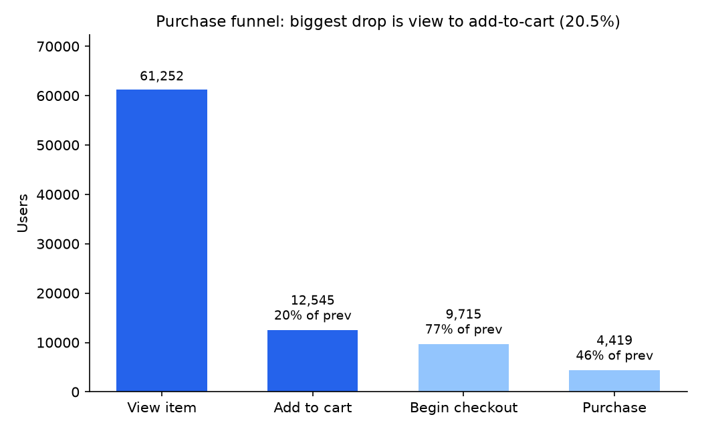
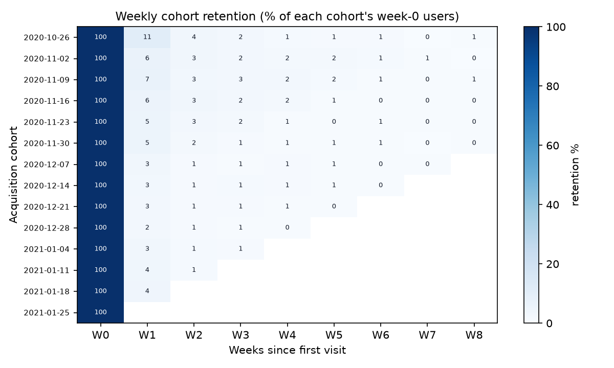
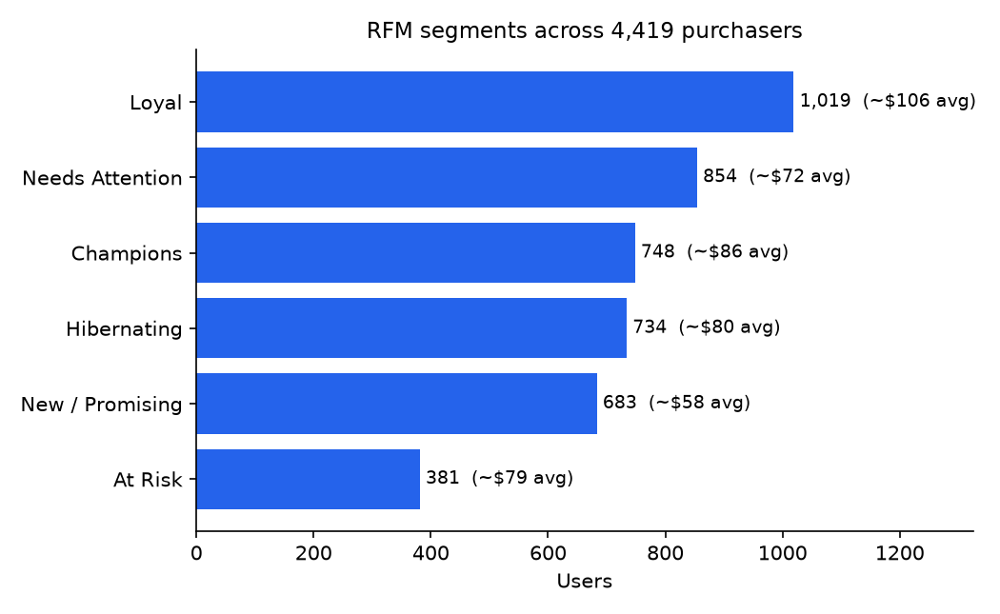

# GA4 Product Analytics: dbt on BigQuery & Snowflake, Power BI dashboard

[](https://github.com/yaserselvam/ga4-dbt-product-analytics/actions/workflows/ci.yml)

An end-to-end product-analytics build on the **public GA4 e-commerce dataset** in BigQuery: raw GA4 events modelled with **dbt** (staging -> marts, tested and documented), analysed in SQL for **funnel conversion, retention cohorts, and RFM segmentation**, and shipped as a **Power BI** dashboard. Built the way a modern London product/marketing analyst role actually works.

> **AI-augmented, human-verified.** I build the dbt models and SQL using an AI-augmented workflow I direct: I set the brief and own every definition, and nothing is trusted until the dbt tests pass and I have reconciled the numbers against the raw events myself. Prompt library in `/prompts`. AI to move faster, never to decide unchecked.

## Runs on two warehouses (BigQuery and Snowflake)

The same dbt project runs on **both BigQuery and Snowflake** and produces identical results. The Snowflake port is in [`snowflake/`](snowflake/README.md): the full public GA4 sample (4,295,584 events) loaded into Snowflake and built with `dbt build` (16/16 nodes passing), matching the BigQuery numbers exactly (`rfm_segments` = 4,419 purchasing users in both). Ingestion is a bulk COPY, with a Fivetran connector demoed separately; auth is Snowflake key-pair, so the build runs non-interactively. The `snowflake/` folder has the full runbook and scripts to reproduce it end to end.

## Results (headline)

**Biggest funnel leak: product view to add-to-cart, only 20.5% convert.** Cart-to-checkout is healthy (77%); checkout-to-purchase loses over half (46%). Full write-up and recommendation in [`outputs/readout.md`](outputs/readout.md).







## Why this project exists

It deliberately covers the modern data-analyst stack that UK job specs (GoHenry, Gousto, the Guardian, Sage, fintech) keep asking for and that most portfolios miss:

- **GA4 + BigQuery** — the standard product/marketing analytics source in 2026.
- **dbt** — analytics-engineering: sources, staging/marts, tests, docs, a semantic layer of clean models.
- **Power BI** — an interactive dashboard on top of a governed model.
- **Product analytics** — funnel/conversion, cohort/retention, and segmentation, the questions these teams actually ask.

## The data (public, free, no PII)

`bigquery-public-data.ga4_obfuscated_sample_ecommerce.events_*` — Google's obfuscated GA4 export for the Google Merchandise Store (roughly Nov 2020 to Jan 2021). Real GA4 event structure (event-per-row, nested `event_params`, `items`), fully obfuscated, no personal data.

- **Cost:** query it inside a **BigQuery sandbox** (free, no card, 1 TB/month free tier). The models are written to scan only what they need.

## Questions answered

1. **Funnel:** of users who view an item, what share reach add-to-cart, begin-checkout, and purchase? Where is the biggest drop-off?
2. **Retention:** for each weekly acquisition cohort, what share return in weeks 1-8?
3. **Segmentation:** an RFM cut of purchasing users, who are the high-value repeat buyers vs one-off vs lapsed?

## Stack & repo layout

```
ga4-dbt-product-analytics/
  dbt_project.yml
  profiles.example.yml          <- copy to ~/.dbt/profiles.yml, fill in your GCP project
  models/
    staging/
      _ga4__sources.yml          <- declares the public GA4 dataset as a dbt source
      stg_ga4__events.sql        <- flattens GA4 events + key event_params (one clean row per event)
    marts/
      fct_sessions.sql           <- session grain, with conversion flags
      funnel_conversion.sql      <- user-level funnel step reached
      retention_cohorts.sql      <- weekly acquisition cohort x weeks-since retention
      rfm_segments.sql           <- RFM scoring + named segments for purchasers
      _marts.yml                 <- tests (not_null, unique, accepted_values) + column docs
  analysis/                      <- standalone BigQuery SQL versions (run without dbt if preferred)
  powerbi/
    README.md                    <- BigQuery connection + dashboard spec
  prompts/
    prompt-library.md
  .gitignore
```

## Run it

1. **BigQuery sandbox:** create a free GCP project at console.cloud.google.com (sandbox = no billing needed), note the project id.
2. **Install dbt:** `pip install dbt-bigquery`.
3. **Auth:** `gcloud auth application-default login` (or a service-account key).
4. **Profiles:** copy `profiles.example.yml` to `~/.dbt/profiles.yml`, set your `project` (dataset can be a new one you own, e.g. `ga4_analytics`); the public source is read cross-project.
5. **Build:** `dbt deps` (if any), then `dbt build` (runs models + tests). `dbt docs generate && dbt docs serve` for the lineage/docs site.
6. **Dashboard:** connect Power BI to your BigQuery project (see `powerbi/README.md`) and build the three views.

## What makes it stand out (not generic)

- A **real, messy, nested** source (GA4), not a tidy CSV.
- **Tested and documented** models (dbt tests + a docs site), not just ad-hoc queries.
- Ends in **decisions**: where the funnel leaks, which cohorts retain, which segments to invest in.
- The **AI-augmented, human-verified** workflow is shown, not claimed (prompt library published).
